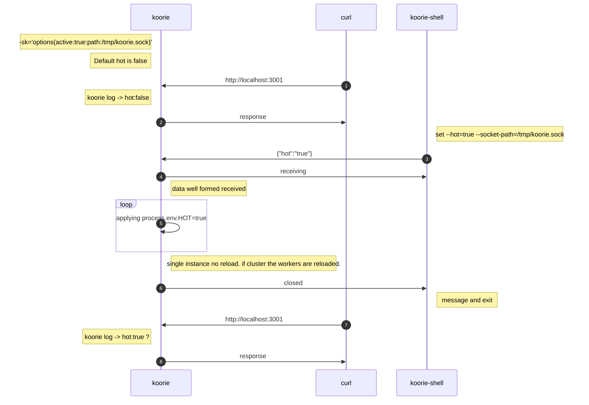
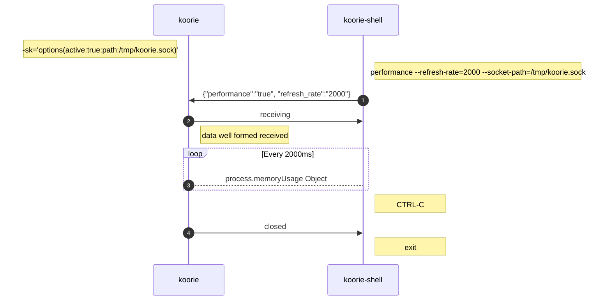

# Koorie

___

###### Node.js server. ESModule asynchronous from the beginning of the Dreamtime.

> ⚠ Consider this package ABSOLUTELY not ready for production environment but try it out for testing and profiling or dev server not exposed to public.
> 
> ⚠ `v1.x.x-experimental` shall be considered unstable like hell. but it works.

___

## Index of Contents

___

- [Description](#description)
  - [The name Koorie](#the-name-koorie)
  - [Yet another NodeJS server](#yet-another-nodejs-server)
- [Installation](#installation)
  - [Koorie as Module](#koorie-as-module)
  - [Koorie global](#koorie-global)
- [Koorie library](#koorie-library)
  - [Koorie server configuration file](#koorie-server-configuration-file)
  - [Koorie terminal flags](#koorie-terminal-flags)
    - [--address[-a]](#--address-a)
    - [--cluster[-c]](#--cluster-c)
    - [--hot](#--hot)
    - [--library[-lb]](#--library-lb)
    - [--logger[-l]](#--logger-l)
    - [--middleware[-m]](#--middleware-m)
    - [--port[-p]](#--port-p)
    - [--protocol[-pr]](#--protocol-pr)
    - [--socket[-sk]](#--socket-sk)
    - [--static-files[-s]](#--static-files-s)
  - [Koorie-Shell commands and flags](#koorie-shell-commands-and-flags)
    - [init command](#init-command)
      - [--bare](#--bare)
      - [--author[-a]](#--author-a)
      - [--description[-d]](#--description-d)
      - [--license[-l]](#--license-l)
      - [--middleware[-m]_](#--middleware-m_)
      - [--name[-n]](#--name-n)
      - [--version[-v]](#--version-v)
    - [route command](#route-command--this-command-it-not-available-yet-consider-this-section-an-idea-on-how-could-be)
      - [--add[-e]](#--add-a)
      - [--edit[-e]](#--edit-e)
      - [--delete](#--delete-d)
    - [koorie-shell socket connection to koorie API](#koorie-shell-socket-connection-to-koorie-api)
    - [--socket-path](#--socket-path)
      - [set command](#set-command)
        - [--hot](#--hot_)
      - [performance command](#performance-command)
        - [--refresh-rate](#--refresh-rate)
    - [Creating routes](#creating-routes)
      - [Route - index](#route---index)
- [Diagrams](#diagrams)
  - [1. changing options on the fly through socket](#1-changing-options-on-the-fly-through-socket)
  - [2. performance lookup](#2-performance-lookup)
- [Road Map](#road-map)
- [JetBrains OSS Licence](#jetbrains-oss-license)

___

### Description

___

#### The name Koorie

Koorie borrows, with respect and admirance, its name from one of the Indigenous Australian clans so named Koorie.  
Their beliefs about the creation of the whole resides in the "Dreamtime" stories. Many of these stories are expressed by artists of this clan and many others.  
I intend to support the freedom and equality of tribes and indigenous humans all over the planet.  
This name is a tribute to all the highest thoughts of equality.

___

#### Yet another Node.js server

Here are we again?  
Nope, I wanted to understand the dynamics behind the more popular NodeJS servers around, like Fastify or Express just to cite some of them, and so I took a chance to develop one from scratch.  
How is going so far?  
One commit is alright the other one completely rewrite the app.  
:D Fun, a lot of fun.

___

### Installation

___

It is possible to install Koorie as a module dependency, or it is possible to install it globally.  
I'll go through both ways explaining some available commands in Koorie and Koorie-Shell.

___

#### Koorie as Module

```shell

# first make a directory and cd
mkdir my-stunning-server && cd my-stunning-server

# regular npm installation
npm install koorie

# once installed, run
npx koorie-shell init --bare # this will setup few files to get you started.

# at the prompt answer yes

# spin it up!
npx koorie 
# you'll be prompt to choose the root directory of the project as the 'public' directory
# at the prompt answer yes

# open the browser at http://localhost:3001

```

___

#### Koorie global

```shell

# first make a directory and cd
mkdir my-stunning-server && cd my-stunning-server

# regular npm installation
npm install --global koorie

# once installed, no more `npx`
koorie-shell init --bare # this will setup few files to get you started.

# at the prompt answer yes

# spin it up!
koorie --port=3847 --cluster

# you'll be prompt to choose the root directory of the project as the 'public' directory
# at the prompt answer yes

# the flag --cluster will spawn processes for the half of the available CPUs

# open the browser at http://localhost:3847

```

However, Koorie is available globally, the project itself needs it as module dependency, so it will be installed project scope anyway.

___

### Koorie library

___

#### Koorie server configuration file

___

> ⚠ The server configuration file is an experimental feature. It works anyway.

> It is a draft (for fun basically) on how it can be the hypothetical server configuration file.
by adding and setting a .koorierc file it is possible to run `npx koorie` ❗ without any flags.

>The Object [ config.parser ] looks for charCode = `32`, at position `0` of the next line read by node:readline interface, that, corresponds to one empty character ( one space ).
In this case everything after the first space will be treated as a comment, so then skipped from being parsed.

- To set an option the flags available must be used without the double prefixing hyphen.
- The `option` name must be followed by one empty character and the equal sign `=`
- The `=` must be followed by an empty character and a string representing the `value` assigned to the `option`.
- Number are parsed and given back as primitive type {number}.

filename -> `.koorierc` must be named like this and must reside in project root directory.

```text

; this is a comment and will be skipped by Object [ config.parser ]

; static_files = path/to/public
; will fail because the option (left operand) must be the same, without double hyphen prefixing, as the flag passed to the command line [--static-files]. ❗ ONLY use the long flags!

; s = path/to/public
; will fail ❗ DO NOT USE short flags!

; I left the line below uncommented 
static-files = path/to/public
; will go through ;)

; static-files= path/to/public
; will fail because ❗ MUST be one empty character from the equal sign for both left operand and right operand!

```

___

#### Koorie terminal flags.

> ⚠ BREAKING CHANGES **since** version 1.x.x.  
> when a flag, for both koorie & koorie-shell, requires key:value options, it must be supplied this way:  
> `npx koorie --logger='options(quiet:true:write:log.txt)'` ♥︎  
> 
> ℹ single quotes are required.
> ___
> ~~before version 1.x.x was supplied this way:  
> npx koorie --logger=quiet:true:write:log.txt~~ ♠︎
___

| flags                                   | description                                                                               | simple usage                                                          |
|:----------------------------------------|:------------------------------------------------------------------------------------------|:----------------------------------------------------------------------|
| --address[-a]={string}                  | Sets the address to listen from. Default set to localhost.                                | `npx koorie -a=localhost`                                             |
| --cluster[-c]={void}-{number}           | When {void} it forks the process for the half of the available CPUs.                      | `npx koorie --cluster`                                                |
| --hot={boolean}-{void}                  | Default is set to false. When {void} it sets hot wired                                    | `npx koorie --hot`                                                    |
| --library[-lb]={string}                 | It tells to Koorie to expect a javascript library application.                            | `npx koorie --library=solid`                                          |
| --logger[-l]={'options(option:value)'}  | Default set to print to stdout every request.                                             | `npm koorie -l='options(quiet:true)'`                                 |
| --middleware[-m]={string}               | Default set to middleware.js.                                                             | `npx koorie -ml=starter.js`                                           |
| --port[-p]={number}-{void}              | Sets the port to listen from. Default set to 3001. When {void} listen from a random port. | `npx koorie -p`                                                       |
| --protocol[-pr]={string}                | Default is set to `http`. Road map -> to spawn an https server.                           | `npx koorie -pr=https`                                                |
| --socket[-sk]={'options(option:value)'} | Default is off. Available options: [active:boolean] required. [path:string] required.     | `npx koorie --socket='options(active:true:path:/tmp/my-server.sock)'` |
| --static-files[-s]={string}             | It tells to Koorie to serve the files located in the specified directory.                 | `npx koorie -s=public`                                                |

> ℹ If all the flags are omitted the default port is `3001`, the address is `localhost` and only a `single` instance of the process will run.  
> and you'll be prompted to confirm the root of your project ad `public directory`.

___

- ##### --address[-a]
  
  - --address[-a]=192.168.1.1 -> It will listen on the specified IP address.
  - Default set to `localhost`

___

- ##### --cluster[-c]
  
  - --cluster[-c]=4 -> It forks the process on 4 CPUs.
  - --cluster[-c] -> It forks processes for the half of the available CPUs
  - --cluster[-c]=foo -> process exits with errors.
  - --cluster[-c]=full -> It forks processes for all the available CPUs
  - Default set to half of the available CPUs.

___

- ##### --hot
  - --hot=true -> it will hot wire koorie. so for every change done to the routes there will be no need to restart the server.
  - Default sets to false
___

- ##### --library[-lb]
  - ⚠ work in progress to differentiate frameworks
  - --library[-lb]=react -> It tells to Koorie to expect a React application. Koorie will look for an index.html file under the `public` directory.
  - --library[-lb]=4789 -> process exits with errors.
___

- ##### --logger[-l]
  
  - --logger[-l]='options(quiet:true:write:logger.log)' -> it will silence the Object [ koorie.logger ], and it will save the log to a file named logger.log in the root directory of the project.
  - Defaults set to `quiet=false` `write=null`

___

- ##### --middleware[-m]
  
  - --middleware[-m]=starter.js -> it will look for a file named starter.js in the root directory of the project, and use it to register all the available routes.
  - Default set to `middleware.js`

___

- ##### --port[-p]
  
  - --port[-p] -> It will listen on a random port.
  - --port[-p]=4789 -> It will listen on port 4789.
  - --port[-p]=foo -> process exits with errors.
  - Default set to `3001`

___

- ##### --protocol[-pr]
  
  - --protocol[-pr]=http -> Default is set to `http`. Road map -> to spawn a https server
  - Default set to `http` the `https` option still not available.
___

- ##### --socket[-sk]
  
  - --socket[-sk]='options(active:true:path:/tmp/koorie.sock)' -> it will open a socket at the specified path.
  - Defaults set to `active=false` `path=null`
  - Options are required. ⚠︎ combination active:false:path:/to/file.sock is not implemented yet.

___

- ##### --static-files[-s]

- --static-files[-s]=public -> It looks for a directory called `public` in the root directory of the project, no found process exits with error.
- --static-files[-s] -> It asks the below question.
  - public path is set to the root directory. is this fine? [yes|no]
  - answers: `yes|no OR y|n`
    - yes - The process will proceed showing a warning in the console that the `public` directory is set to the root directory of the project. Koorie will look "here" for files requested at the server. Not that safe right?
    - no - It will ask to specify a directory.
  - --static-files=28 -> process exits with errors.
  - Default it will ask the above question.
___

#### Koorie-Shell commands and flags

___

| commands    | flags                         | description                                                       | simple usage                                                                      |
|:------------|:------------------------------|:------------------------------------------------------------------|:----------------------------------------------------------------------------------|
| init        | --bare={void}                 | Generates a project in current working directory ❗️ [overwrites]  | `npx koorie-shell init --bare`                                                    |
|             | --author[-a]={string}         | Default set to null.                                              | `npx koorie-shell init -a='John Doe'`                                             |
|             | --description[-d]={string}    | Default set to null.                                              | `npx koorie-shell init -d='My Project'`                                           |
|             | --license[-l]={string}        | Default set to null.                                              | `npx koorie-shell init -l=Apache-2.0`                                             |
|             | --middleware[-m]={string}     | Default set to 'middleware[.js]'.                                 | `npx koorie-shell init -m=starter.js`                                             |          
|             | --name[-n]={string}           | Default set to null.                                              | `npx koorie-shell init -n=my-project`                                             |     
|             | --version[-v]={semver-string} | Default set to 0.0.1.                                             | `npx koorie-shell init -v=10.2.236`                                               |
| route       | --add[-a]={JSON} ❗️           | Add a basic route                                                 |                                                                                   |
|             | --delete[-d]={JSON} ❗️        | Delete a route                                                    |                                                                                   |
|             | --edit[-e]={JSON} ❗️          | Edit a route                                                      |                                                                                   |
| set         | --hot={boolean}               | Switcher                                                          | `npx koorie-shell set --hot=false --socket-path=/tmp/koorie.sock`                 |
|             | --socket-path={string}        | Path to koorie socket. required                                   | `npx koorie-shell set --hot-false --socket-path=/tmp/koorie.sock`                 |
| performance | --refresh-rate={number}       | Stats refresh rate in milliseconds                                | `npx koorie-shell performance --refresh-rate=2000 --socket-path=/tmp/koorie.sock` |
|             | --socket-path={string}        | Path to koorie socket. required                                   | `npx koorie-shell performance --socket-path=/tmp/koorie.sock`                     |

___

- ##### init command

  - ##### --bare
    - --bare
    - using this flag will overwrite everything in the root directory of the project.  
      anyway it will be asked confirmation

  - ##### --author[-a]
    - --author[-a]='John Doe'
    - It sets the author property of the package.json
  
  - ##### --description[-d]
    - --description[-d]='my amazing project'
    - It sets the description property of the package.json
  
  - ##### --license[-l]
    - --license[-l]=Apache2.0
    - It sets the license property of the package.json
  
  - ##### --middleware[-m]_
    - --middleware[-m]=starter.js
    - It creates a middleware file named starter.js, and it set the npm script 'serve' to use this as default middleware loader.
  
  - ##### --name[-n]
    - --name[-n]=my-amazing-project
    - It sets the name property of the package.json
  
  - ##### --version[-v]
    - --version[-v]=10.23.635
    - It sets the version property of the package.json

- ##### route command ❗ this command it `NOT AVAILABLE` yet. Consider this section an idea on how could be.
  
  - ##### --add[-a]
    - --add[-a]=dang
    - It saves a route with name `dang` into the directory `./routes/dang/route.js`
    - It adds the route to the middleware.js file.
  
  - ##### --delete[-d]
    - --delete[-d]=dang
    - It deletes the route named `dang`
  
  - ##### --edit[-e]
    - --edit[-e]=dang::path:dang/dang
    - It edits a route with name `dang` by changing the path, served by the middleware function, to `dang/dang` instead of `dang`

- ##### koorie-shell socket connection to koorie API

- ##### --socket-path

  - > all the commands, socket related, must explicit define the path to koorie socket file with the flag `--socket-path=/path/to/koorie.sock` 

- ##### set command
  
  - ##### --hot_
    - set --hot=false --socket-path=/path/to/koorie.sock
    - it will switch the hot wired to off. anytime a route has changed the server must be restarted

- ##### performance command
  
  - ##### --refresh-rate
    - performance --refresh-rate=2000 --socket-path/path/to/koorie.sock
    - it will stream every 2 seconds the process.memoryUsage object

___

#### Creating routes

Koorie has a simple interface for creating routes and handle them.  
Small guide step by step:

- Server from scratch.
  - server without using ~~npx koorie-shell init~~ command.
  - add the middleware handler.
  - add one route named index that serve the http://localhost:3001
  - add a GET request handler
  - adding a `public` directory
  - add a static file to be read and send back.
  - make a request and get the response.
  - using `npx koorie-shell set --hot=false --socket-path=/tmp/koorie.sock` to check the socket functionality

#### Route - `index`

`mkdir s-scratch && cd s-scratch && npm install koorie`

Open the 'package.json' file and add the property "type":"module" save it.

`mkdir -p routes/index` && `touch ./middleware.js ./routes/index/route.js`
`mkdir public` && `echo 'give me file! allright!' > public/allright`

filename `./middleware.js`

```javascript
import { routes }  from 'koorie'

export default async () => {
	
    // Object [ koorie.routes ] is an object 'container' 
	// the route property set to an empty string will answer to http://localhost:3001
    // the asyncFunction property will import dynamically the route index
    // these two properties are required
    // routes always declared as async function returning an Answer
    // the incoming property should be set if the route responds to a GET|POST|PUT|DELETE request
    // in this case it will answer at http://localhost:3001 and the request will be GET [?give_me_file=allright]
    routes.list.push( { route:'', asyncFunction: ( await import( './routes/index/route.js' ) ).index, incoming: ''  } )
    
    // the koorie.routes.set() will do type checking of the given object and registering the route inside Object [ koorie.routes ]
    await routes.set()
}

```

filename `./routes/index/route.js`
> ⚠ Working in progress. On the next commit will be ready.
```javascript
/**
 * Route (- index) - The simplest way to serve a route.
 * It is required to be an async function.
 * It is required to return an Answer.
 *
 * It accept two arguments but none of them is a required argument.
 * 
 * arguments passed to the route by Object [ koorie.routing ] :
 *
 * - Server.IncomingMessage
 * - Server.ServerResponse
 * 
 * Object Answer extends Promise so it works the same way.
 * Also it incorporates Object [ koorie.request ] and all its functions and properties.
 * before v.1.x.x the koorie.request was called koorie.incoming exported as koorieIncoming
 * 
 * It depends by the constructed logic if resolve or reject.
 *
 * @returns {Promise|Buffer}
 */
export async function index(incoming, outgoing){
    
    // obviously answers bad when it rejects :D
    return new Answer( good => good( Buffer.from( JSON.stringify( { 'index-route': 'response' } ) ) ) )
}

```

spin up the server --hot wired and socket at the specified path.  
we will edit the route on the fly and see the changes without reloading the server.  
we will test koorie-shell, switching off the --hot wired and see that no longer any changes to the route will be rendered.

`npx koorie --static-files=public --socket='options(active:true:path:/tmp/koorie.sock)' --hot`

```shell

curl -verbose http://localhost:3001/?give_me_file=allright | jq 
# 'jq' is a small utility that formats json strings in the terminal.
# request/response header shown because of the -verbose flag passed to curl
# the response should be {"index-route":"response"}
# and should also download a file.

```

__

### Diagrams

___

####  1. changing options on the fly through socket



___

####  2. performance lookup



___

### Road Map

- [ ] `--https[-s]` spawning https server and relative --protocol option.
- [ ] `--private-key[-k]` loading the private key for SSL.
- [ ] `--public-key[-pk]` loading the public key for SSL.
- [ ] `--ssl` generating self-signed certificate.
- [ ] `--certbot[cb]` request to Lets Encrypt for a certificate, installing it and auto updating it.
- [ ] `route` command and relative flags `--add[-a]`, `--delete[-d]`, `--edit[-e]` and relative options.
- [X] working on a way to add routes without restarting the server.
- [ ] proxy server???
- [ ] koorie website and documentation
- [ ] more socket API functionalities
___

### JetBrains OSS License

___

I want to thank JetBrains to grant me the Open Source Software license for all their products. This opportunity gives me strength to keep on going with my studies and personal project.  
To learn more about this opportunity have a look at [Licenses for Open Source Development - Community Support](https://www.jetbrains.com/community/opensource/).

_Thank you_

