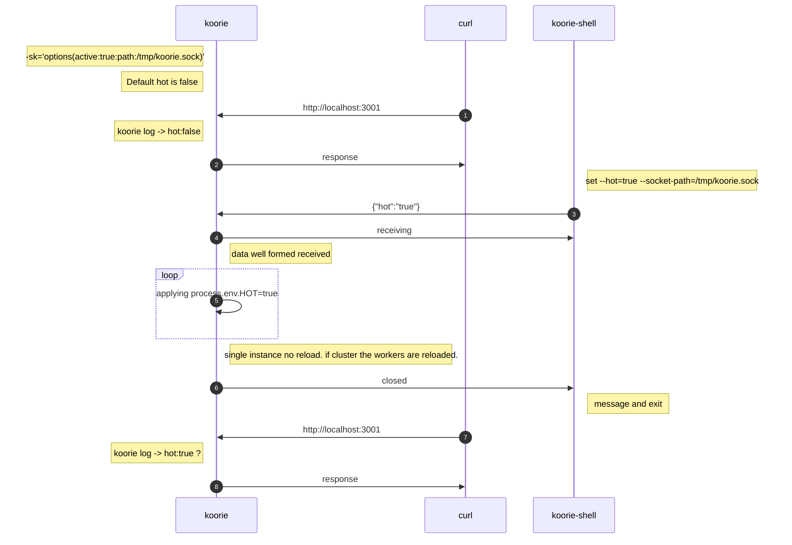
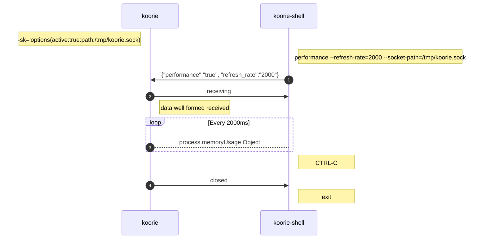

# Diagrams

___

- Diagrams
  - [1. changing options on the fly through socket](#1-changing-options-on-the-fly-through-socket)
  - [2. performance lookup](#2-performance-lookup)

___

### 1. changing options on the fly through socket

___

### 2. performance lookup

___
